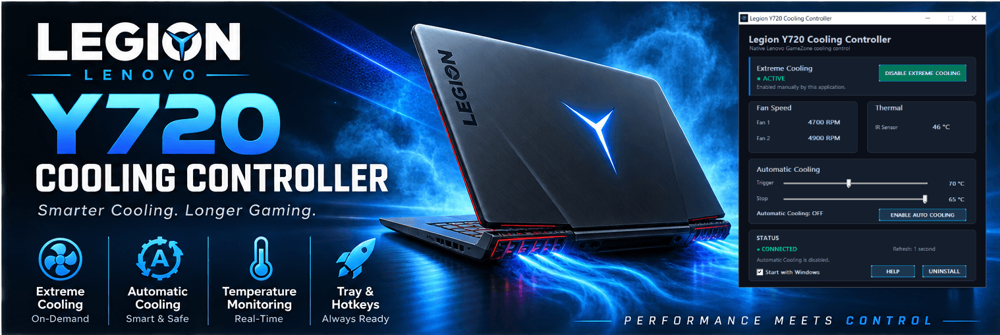
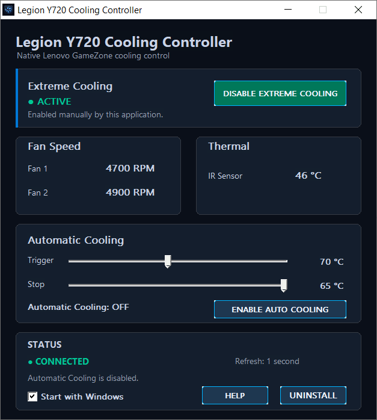

# Legion Y720 Cooling Controller for Windows

<p align="center">
  
</p>

<p align="center">
  This project provides a native Windows interface for the Lenovo Legion Y720's cooling controls without depending on the Lenovo Nerve Center / Nerve Sense application interface.

  The controller communicates directly with the Lenovo GameZone WMI interface exposed by the Y720. It provides real-time fan and thermal monitoring, manual Extreme Cooling control, and automatic temperature-based Extreme Cooling.
</p>

<p align="center">
  
</p>

This project provides a native Windows interface for the Lenovo Legion Y720's cooling controls without depending on the Lenovo Nerve Center / Nerve Sense application interface.

The controller communicates directly with the Lenovo GameZone WMI interface exposed by the Y720. It provides real-time fan and thermal monitoring, manual Extreme Cooling control, and automatic temperature-based Extreme Cooling.

> **Release status:** **v2.0.0** is the current stable release.

## Download

The current stable release is **v2.0.0**.

The release package contains the standalone Windows executable and does not require a separate installer.

- **[Download Latest Release](../../releases/latest)**
- **[View All Releases](../../releases)**
- **[Download Source Code](../../archive/HEAD.zip)**

For the exact source code corresponding to this release, use the source archive attached to the **v2.0.0** release or browse the `v2.0.0` tag.

## Features

- Native Windows GUI
- DPI-aware GUI layout
- Lenovo Legion-inspired dark blue interface
- Fan 1 speed monitoring in RPM
- Fan 2 speed monitoring in RPM
- Lenovo GameZone IR / thermal sensor monitoring
- Manual Extreme Cooling control
- Automatic temperature-based Extreme Cooling
- Configurable trigger and stop temperatures
- 10-second temperature persistence before automatic state changes
- 5°C minimum hysteresis between trigger and stop thresholds
- Background IR-temperature monitoring while Automatic Cooling is enabled
- System-tray integration
- `Ctrl + Shift + 0` global Extreme Cooling shortcut
- Optional Start with Windows
- Single-instance application
- Persistent Automatic Cooling settings
- Built-in uninstall and cleanup
- Safe Extreme Cooling shutdown when the application exits
- No separate installer required

## Requirements

The controller was developed and tested specifically for:

- Lenovo Legion Y720
- Windows 10
- 64-bit Windows
- Administrator privileges
- Lenovo GameZone WMI interface available on the system

The application does not communicate through Lenovo Nerve Center itself. It communicates directly with the Lenovo GameZone WMI interface required by the Y720's cooling hardware.

Because Lenovo's original software and platform components are old, the required GameZone WMI interface may not be present on every installation of Windows.

### Important

This project is specifically designed for the **Lenovo Legion Y720**. Compatibility with other Lenovo Legion models is not guaranteed.

## Installation

No installer is required.

Download the latest release, extract the release package, place the executable in a convenient location, and run:

```text
Y720CoolingController.exe
```

Windows will request administrator privileges because the application requires access to the Lenovo GameZone WMI interface.

If the application reports that the GameZone WMI interface is unavailable, use the built-in **HELP** button to open the official Lenovo support/download page for the Legion Y720 and check the software and drivers available for the system.

The original Lenovo Nerve Center / Nerve Sense software was the Y720's gaming-control software, but its availability has changed over time. The controller should therefore not assume that a particular Lenovo installer is still available.

## Cooling Control

### Manual Extreme Cooling

The main Extreme Cooling control is a single toggle button.

When disabled:

```text
ENABLE EXTREME COOLING
```

When enabled:

```text
DISABLE EXTREME COOLING
```

The controller records the Extreme Cooling state that **this application** has successfully commanded.

The application deliberately does not treat the Lenovo `GetFanCoolingStatus` WMI method as authoritative because it was found to be unreliable on the tested Y720.

As a result, the displayed state means:

> **This application believes Extreme Cooling is enabled because its most recent command was accepted by the Lenovo GameZone WMI interface.**

It is not presented as an independently verified physical fan-state reading.

### Extreme Cooling and application exit

Extreme Cooling is treated as a session state.

When the application exits, it makes a best-effort attempt to disable Extreme Cooling before releasing the Lenovo GameZone WMI connection.

The application never restores a previously active Extreme Cooling command merely because the application is started again.

This is intentional for safety.

## Automatic Cooling

Automatic Cooling uses the Y720's working **IR / thermal sensor** as its temperature source.

The Y720's CPU and GPU temperature methods were investigated during development but were not usable on the tested system, so Automatic Cooling is based on the IR temperature method that was confirmed to work.

### Trigger and Stop

Automatic Cooling has two independent thresholds:

- **Trigger temperature** — temperature at which Extreme Cooling can be activated
- **Stop temperature** — temperature at which Extreme Cooling can be deactivated

The stop threshold is constrained to remain at least **5°C below the trigger threshold**.

The user can adjust both values with sliders.

The current default values are:

```text
Trigger: 70 °C
Stop:    65 °C
```

### 10-second persistence

Automatic Cooling does not immediately react to a single temperature crossing.

The temperature must remain:

```text
At or above Trigger
```

for **10 consecutive seconds** before Extreme Cooling is enabled.

Once Extreme Cooling is active, the temperature must remain:

```text
At or below Stop
```

for **10 consecutive seconds** before Extreme Cooling is disabled.

If the condition is interrupted, the relevant countdown resets.

Temperatures between the Trigger and Stop thresholds do not cause a state change.

Example:

```text
Trigger = 70 °C
Stop    = 65 °C

70 °C or higher for 10 seconds
        ↓
Extreme Cooling ON

65–69 °C
        ↓
Remain in current state

65 °C or lower for 10 seconds
        ↓
Extreme Cooling OFF
```

The interface displays the persistence state, including:

```text
Automatic Cooling: WAITING (x/10 s)
```

and:

```text
Automatic Cooling: STOPPING (x/10 s)
```

### Background monitoring

Normal full telemetry refresh is intentionally limited when the main window is not in the foreground.

When Automatic Cooling is enabled, however, the controller continues monitoring the IR temperature in the background, including while the main window is minimized.

Background Automatic Cooling uses the lightweight IR-temperature read path rather than unnecessarily polling the full fan telemetry set every second.

This allows Automatic Cooling to continue functioning without requiring the main GUI to remain open on screen.

### Automatic Cooling persistence

The user's Automatic Cooling preference and temperature thresholds are saved.

When the application starts again:

- the saved Trigger and Stop temperatures are restored;
- the saved Automatic Cooling preference is restored;
- Automatic Cooling starts a fresh monitoring cycle;
- Extreme Cooling is **not** automatically forced on merely because it was active during the previous session.

This distinction is intentional.

## System Tray

The controller can remain running in the Windows notification area.

The tray menu provides quick access to:

- Turn Extreme Cooling on or off
- Turn Automatic Cooling on or off
- Open the main controller window
- Exit the application

The application also attempts to restore its tray icon if Windows Explorer is restarted.

### Important

The application must remain running in the system tray for background features to work.

In particular, the tray process is required for:

- Automatic Cooling background monitoring
- the global `Ctrl + Shift + 0` shortcut

Closing the main window normally hides the application to the tray rather than terminating the process.

Use **Exit** from the tray menu to terminate the application.

## Ctrl + Shift + 0

The controller implements a global:

**Ctrl + Shift + 0**

shortcut for toggling Extreme Cooling.

The shortcut uses the same control path as the GUI and tray toggle, so the application does not maintain a separate cooling-control implementation for the hotkey.

The application must remain running in the notification area for the shortcut to work while the main window is hidden.

## Start with Windows

The GUI includes an optional **Start with Windows** setting.

When enabled, Windows starts the controller at user logon.

The startup mechanism uses Windows Task Scheduler with the elevated execution level required by the application.

Startup launches the application hidden so that it can remain available through the system tray without opening the main window on every login.

The application also removes the obsolete legacy startup entry used by earlier versions.

## Single Instance

Only one instance of the controller can run at a time.

Launching the application again while it is already running signals the existing instance and brings it to the foreground instead of starting a second controller.

## Configuration

The controller stores its user settings in:

```text
%APPDATA%\LegionY720CoolingController\settings.ini
```

The saved settings include:

```ini
[Automatic Cooling]
TriggerTemperature=70
StopTemperature=65
AutomaticCooling=0
```

The values are validated when loaded.

Invalid or out-of-range values are replaced with safe defaults and the Stop threshold is constrained to maintain the required hysteresis.

Users normally do not need to edit the file manually.

## WMI Connection Status

The status area reports whether the application is currently able to communicate with the Lenovo GameZone WMI interface.

**CONNECTED** means that the application successfully obtained the required telemetry through that interface.

It does **not** mean that Lenovo Nerve Center is running.

If the controller reports a WMI error, use the **HELP** button in the GUI for guidance and to open the official Lenovo Y720 support/download page.

## Uninstall

The controller includes an **UNINSTALL** function in the GUI.

The uninstall process:

- removes the application's startup configuration;
- removes the saved configuration file;
- removes the application's configuration directory when possible;
- schedules the executable for deletion after the next restart.

Extreme Cooling safety shutdown is performed before the application releases its Lenovo GameZone WMI connection.

## Building from Source

The project is written in native C for Windows and uses the Win32 API together with the Lenovo GameZone WMI interface.

The supplied build script uses the **MinGW-w64 UCRT64** toolchain provided by MSYS2.

The current build environment expects:

```text
C:\msys64\ucrt64\bin\gcc.exe
C:\msys64\ucrt64\bin\windres.exe
```

### Build

Run:

```text
build.bat
```

The build script:

1. Cleans the `build` directory
2. Compiles the Lenovo GameZone / WMI controller
3. Compiles the utility module
4. Compiles the GUI
5. Compiles the Windows resource file
6. Links the final executable

The generated executable is placed in:

```text
build\Y720CoolingController.exe
```

## Project Structure

```text
Legion-Y720-Cooling-Controller-Windows/
│
├── src/
│   ├── Y720CoolingControllerGUI.c
│   ├── Y720CoolingController.c
│   ├── Y720CoolingController.h
│   ├── Y720CoolingController.rc
│   ├── Y720CoolingController.manifest
│   ├── utils.c
│   ├── utils.h
│   ├── theme.h
│
├── resources/
│   └── Y720CoolingController.ico
│
├── assets/
│   ├── github-social-preview.png
│   ├── screenshot.png
│   └── Y720Cooling.png
│
├── build.bat
├── README.md
└── LICENSE
```

The `build` directory is generated during compilation and is not part of the source distribution.

## Technical Notes

The application uses the Y720's Lenovo GameZone WMI interface under:

```text
ROOT\WMI
```

and communicates with the known Y720 GameZone object:

```text
LENOVO_GAMEZONE_DATA
```

The tested controller uses:

```text
GetFan1Speed
GetFan2Speed
GetIRTemp
SetFanCooling
```

The Lenovo GameZone interface exposes additional WMI methods, but the controller intentionally uses only the methods that were verified to be useful on the tested Y720.

In particular:

- `GetFanCoolingStatus` was found to be unreliable for determining the physical Extreme Cooling state;
- `GetCPUTemp` and `GetGPUTemp` were not usable on the tested Y720;
- `GetTriggerTemperatureValue` was exposed by the WMI schema but could not be reliably invoked on the tested system.

The application therefore avoids depending on those methods.

## Performance and Polling Design

The controller intentionally avoids unnecessary background WMI traffic.

When the GUI is actively being used, normal telemetry is refreshed approximately once per second.

When the application is not in the foreground, full fan telemetry polling is suspended unless Automatic Cooling requires continued monitoring.

With Automatic Cooling enabled in the background, the controller uses the lightweight IR-temperature read path required by the automatic control algorithm.

This design keeps the controller responsive while avoiding pointless background polling when the extra telemetry is not needed.

## Compatibility

This project was developed and tested specifically on a:

- Lenovo Legion Y720
- Windows 10
- 64-bit Windows

Because the Lenovo GameZone WMI implementation can vary by hardware revision, firmware, Windows installation, and supporting Lenovo software, compatibility with other Lenovo models is not guaranteed.

## Reporting Compatibility

If you have a different Lenovo Legion laptop that previously used Nerve Sense or Nerve Center, you are welcome to test the application and report the results.

Please include:

- Exact laptop model
- Windows version
- Whether GameZone WMI is available
- Whether the application launches successfully
- Whether fan speeds are reported
- Whether the IR temperature is reported
- Whether Extreme Cooling responds
- Whether `Ctrl + Shift + 0` works
- Whether Automatic Cooling works
- Any unexpected behaviour or errors

Please do not assume that behavior on another Legion model will be identical to the Y720.

## Security and System Design

The controller is designed to remain as lightweight and minimally invasive as practical.

It does not install:

- Kernel drivers
- Keyboard filter drivers
- Background services
- A permanent privileged service
- Lenovo Nerve Center
- Lenovo Nerve Sense

The application does require administrator privileges because the Lenovo GameZone WMI interface used by the Y720 requires elevated access in the tested environment.

Startup uses Windows Task Scheduler so the application can begin at user logon with the required elevation.

The controller communicates with the Lenovo firmware through the existing GameZone WMI interface and does not modify or replace Lenovo firmware.

Configuration values and startup settings are validated defensively to reduce the risk of malformed settings causing unintended behaviour.

## Why This Project Exists

The Lenovo Legion Y720 remains a capable gaming laptop, but its original software ecosystem is no longer a dependable way to control its cooling functions on modern Windows installations.

This project provides a small native Windows controller built specifically around the Y720's available GameZone interface.

The goal is to provide useful cooling control and monitoring without requiring the original Nerve Center interface to be used as the application's front end, while keeping the software transparent, lightweight, and focused on the Y720 hardware.

## Release History

### v2.0.0

Major update transforming the original Cooling Monitor into a full Lenovo Legion Y720 cooling controller.

Included:

- Redesigned Legion-inspired native Windows GUI
- Manual Extreme Cooling control
- Automatic temperature-based Extreme Cooling
- Configurable trigger and stop temperatures
- 10-second temperature persistence before automatic state changes
- 5°C minimum hysteresis between trigger and stop thresholds
- Real-time Fan 1 and Fan 2 RPM monitoring
- Lenovo GameZone IR temperature monitoring
- Background Automatic Cooling monitoring
- System-tray integration
- Tray controls for Extreme Cooling and Automatic Cooling
- Global `Ctrl + Shift + 0` Extreme Cooling shortcut
- Optional Start with Windows support
- Windows Task Scheduler based startup
- Persistent Automatic Cooling settings
- Single-instance application
- Built-in uninstall and cleanup
- Safe Extreme Cooling shutdown when the application exits
- Explorer restart handling for the system-tray icon
- Improved WMI handling and reduced unnecessary polling
- Defensive configuration validation
- Updated application branding and resources
- No separate installer required

The application continues to communicate directly with the Lenovo GameZone WMI interface rather than using the Lenovo Nerve Center / Nerve Sense application interface.

### v1.0.0

Initial public release.

Included:

- Fan 1 monitoring
- Fan 2 monitoring
- Thermal / IR sensor monitoring
- Extreme Cooling ON/OFF control
- Native Windows GUI
- Application icon
- Lenovo GameZone WMI integration
- Administrator manifest

## Disclaimer

This software is provided for use with the Lenovo Legion Y720.

Use it at your own risk. The author is not responsible for hardware damage, data loss, system instability, or other consequences resulting from the use of this software.

The controller relies on Lenovo's GameZone WMI interface and does not modify or replace Lenovo firmware.

The software is intended specifically for the Lenovo Legion Y720 and may not work correctly on other Lenovo systems.

## License

This project is licensed under the **MIT License**.

See [LICENSE](LICENSE) for the full license text.
